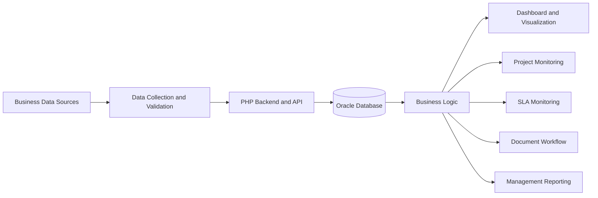
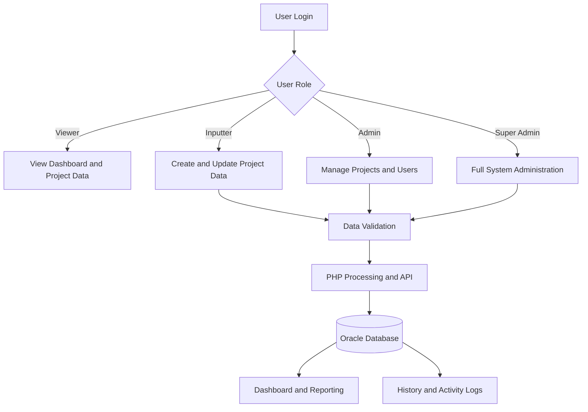

<div align="center">

# Enterprise Project Monitoring Dashboard

### An Anonymized Data & Business Intelligence Case Study

**Oracle Database · PHP · JavaScript · Dashboard · Workflow · REST-style API**

</div>

---

## Overview

This repository presents an anonymized case study of an enterprise project monitoring dashboard developed to support project tracking, SLA monitoring, document workflows, business performance analysis, and management reporting.

The original application was developed for an internal enterprise environment.

To protect confidential information, this repository does not contain original source code, credentials, internal infrastructure details, real customer information, financial data, or company documents.

---

## Business Problem

Project monitoring activities were previously distributed across multiple files and manual reporting processes.

This created several challenges:

- Inconsistent project status reporting
- Limited visibility into project progress
- Difficulty monitoring SLA performance
- Manual preparation of management reports
- Inconsistent document and revision tracking
- Limited access control between different user roles
- Difficulty maintaining historical changes
- Data duplication and validation issues

The objective was to build a centralized application that could provide structured project data, workflow visibility, performance monitoring, and actionable business insights.

---

## Project Objectives

The application was designed to:

- Centralize enterprise project monitoring data
- Monitor project progress from initiation to completion
- Provide structured SLA compliance monitoring
- Present business and financial KPIs
- Manage project documents and revisions
- Maintain project change history
- Provide different access levels for each user role
- Improve data consistency and reporting efficiency
- Support operational and management decision-making

---

## My Responsibilities

My responsibilities in this project included:

- Researching and analyzing business requirements
- Translating operational processes into digital workflows
- Designing and managing Oracle database structures
- Developing PHP-based backend processes
- Developing REST-style API endpoints
- Creating data validation and transformation logic
- Building interactive dashboards and visualizations
- Developing project monitoring features
- Implementing SLA compliance monitoring
- Implementing document upload and revision history
- Developing role-based access control
- Creating user management and activity logs
- Performing application testing and troubleshooting
- Supporting deployment on an enterprise intranet server
- Preparing system documentation and user procedures
- Transforming operational data into management insights

---

## System Architecture



---

## Application Workflow



---

## Main Features

- User authentication and session management
- Enterprise project monitoring
- Project status tracking
- Document status monitoring
- SLA compliance monitoring
- Target monitoring
- KPI and financial performance visualization
- Project detail and timeline history
- Project revision history
- PDF document management
- File upload validation
- Role-based access control
- User management
- Activity logging
- Data filtering and searching
- Management reporting
- Responsive dashboard interface
- Oracle database integration

---

## User Roles

| Role | Main Access |
|---|---|
| Viewer | View dashboard, reports, and project information |
| Inputter | Add and update project information |
| Admin | Manage project data, users, and activity history |
| Super Admin | Full application and user administration |

---

## Data Flow

```text
Business and Operational Data
              ↓
     Data Collection
              ↓
    Validation and Cleaning
              ↓
       PHP Processing
              ↓
       Oracle Database
              ↓
 Business Logic and Workflow
              ↓
 Dashboard and Visualization
              ↓
Management Insight and Reporting
```

---

## Database Scope

The Oracle database was designed to support:

- Project master data
- User accounts
- User roles and privileges
- Project monitoring records
- Status history
- SLA monitoring records
- Project revision records
- Document metadata
- File information
- Activity logs
- Reporting data

The database structure presented in this repository is simplified and anonymized.

---

## Technology Stack

| Layer | Technology |
|---|---|
| Database | Oracle Database |
| Database Query | SQL |
| Database Connection | OCI8 |
| Backend | PHP |
| API | REST-style API |
| Frontend | HTML, CSS, JavaScript |
| Visualization | JavaScript-based charts |
| Server | Apache HTTP Server |
| Operating System | Linux |
| Data Input | Web forms and structured files |
| Database Tool | DBeaver |
| Development Tool | Visual Studio Code |
| Version Control | Git and GitHub |
| Documentation | Markdown, Word, and PowerPoint |

---

## Dashboard Information

The dashboard was developed to present:

- Project composition
- Project status
- Document status
- SLA compliance
- Project progress
- Revenue and profitability indicators
- Gross profit
- Gross profit margin
- EBITDA
- EBITDA margin
- Regional or business-unit performance
- Project monitoring lists
- Historical project changes

---

## Project Outcomes

The application provided:

- Centralized project monitoring information
- Improved visibility of project progress
- More structured SLA monitoring
- Faster management reporting
- Better document and revision tracking
- Clearer access control between users
- Reduced dependency on manual reporting files
- Improved data consistency
- Improved historical traceability
- Better operational accountability
- More accessible business insights

---

## Skills Demonstrated

- Data Engineering
- Business Intelligence
- Data Analytics
- Competitive and Business Research
- Oracle Database Development
- SQL Development
- PHP Backend Development
- API Development
- Dashboard Development
- Data Visualization
- Business Process Analysis
- Workflow Design
- Role-Based Access Control
- Data Validation
- Application Testing
- Server Deployment
- Technical Documentation

---

## Repository Structure

```text
enterprise-project-monitoring-dashboard-case-study/
├── README.md
└── docs/
    ├── architecture-diagram.png
    ├── workflow-diagram.png
    ├── database-design.png
    └── screenshots/
        ├── dashboard-overview.png
        ├── project-monitoring.png
        ├── project-detail.png
        └── user-management.png
```

The documentation and screenshot files will be added gradually.

---

## Screenshots

Screenshots will be added using anonymized or synthetic data.

All company names, customer names, project values, usernames, internal URLs, IP addresses, documents, and confidential information will be removed or replaced.

---

## Confidentiality Notice

This repository contains an anonymized project case study for portfolio and educational purposes.

It does not contain:

- Original application source code
- Real company or customer data
- Internal usernames or employee information
- Database credentials
- Oracle connection details
- Internal IP addresses
- Intranet URLs
- Confidential documents
- Original database schemas
- Actual financial values
- Company intellectual property

All names, values, diagrams, screenshots, workflows, and technical structures have been simplified, anonymized, or replaced with synthetic examples.

---

<div align="center">

**Turning enterprise data into structured workflows, dashboards, and actionable business insights.**

</div>
