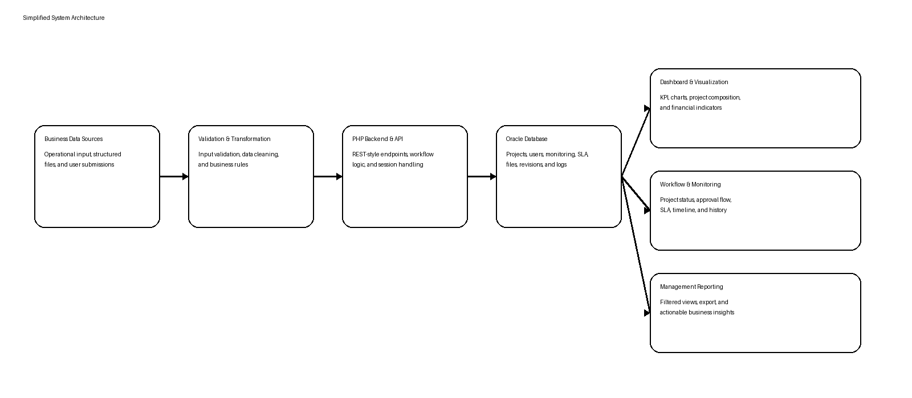
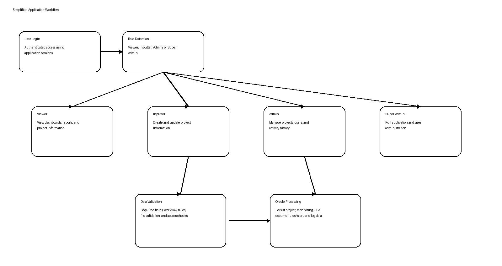
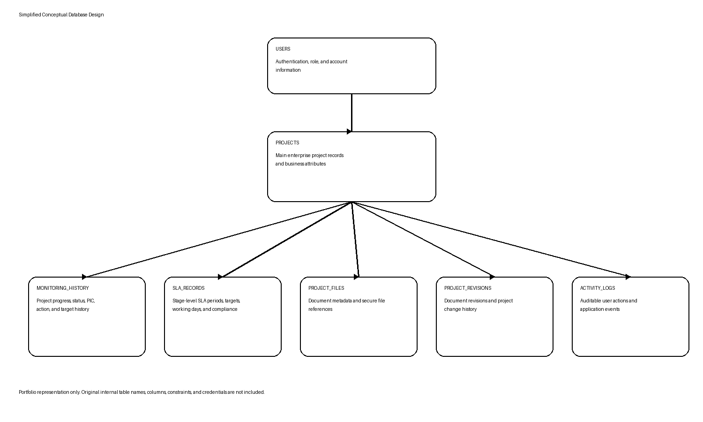
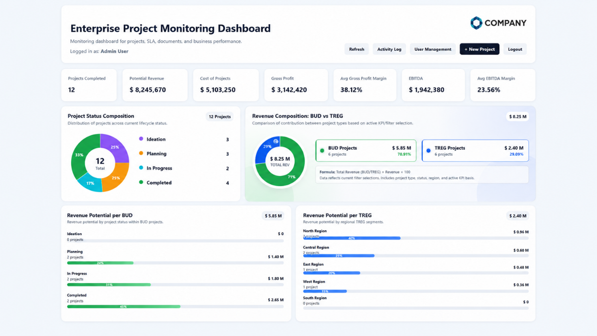
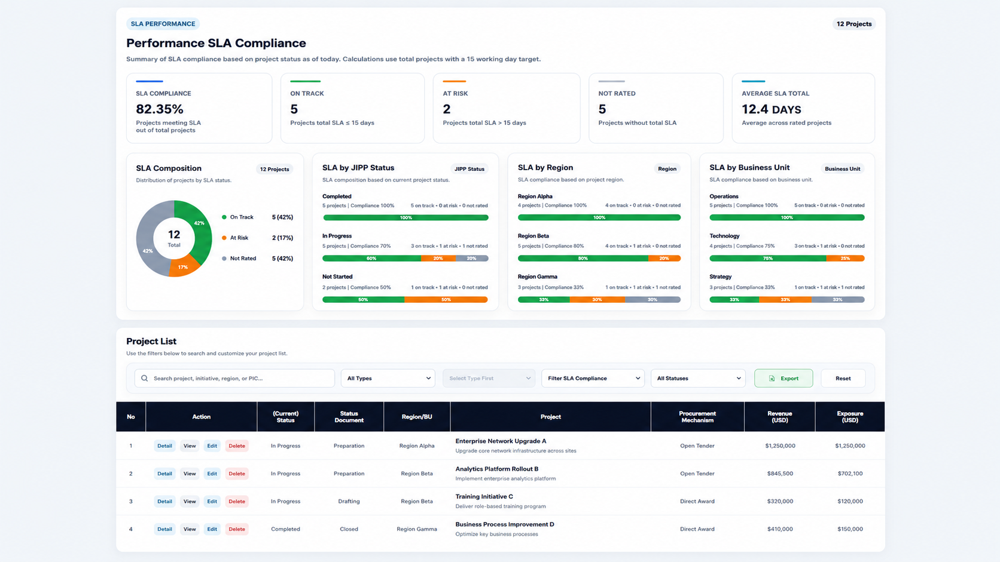
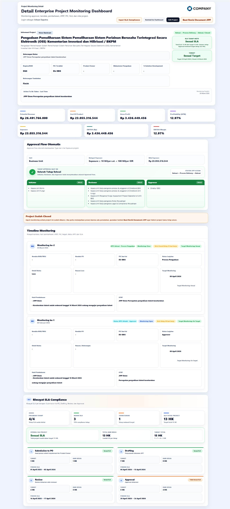

<div align="center">

# Enterprise Project Monitoring Dashboard

### An Anonymized Data & Business Intelligence Case Study

**Oracle Database · PHP · SQL · JavaScript · Dashboard · Workflow · REST-style API**

</div>

---

## Overview

This repository presents an anonymized portfolio case study of an enterprise project monitoring dashboard developed to support project tracking, SLA monitoring, approval workflows, document history, business performance analysis, and management reporting.

The original application was developed for an internal enterprise environment. Original source code, credentials, customer information, internal infrastructure details, confidential documents, and actual financial records are not included.

> **Visual note:** The screenshots in this repository are anonymized portfolio recreations based on the implemented application. They use synthetic names and values to protect confidential information.

---

## Project Snapshot

| Item | Description |
|---|---|
| Project Type | Enterprise Project Monitoring Dashboard |
| My Role | Data & Business Intelligence Engineer |
| Database | Oracle Database |
| Backend | PHP and REST-style API |
| Frontend | HTML, CSS, and JavaScript |
| Environment | Enterprise intranet |
| Core Functions | Dashboard, SLA, workflow, API, reporting, and role-based access |
| Data | Anonymized and synthetic portfolio data |

---

## Business Problem

Project monitoring was previously distributed across multiple files and manual reporting processes. This created inconsistent project status reporting, limited visibility, difficulty monitoring SLA performance, repetitive report preparation, weak revision traceability, and inconsistent access control.

The objective was to centralize project data, operational workflows, SLA monitoring, documents, history, and management insights in one application.

---

## My Responsibilities

- Analyzed business and operational requirements
- Translated business processes into application workflows
- Designed and managed Oracle database structures
- Developed PHP-based backend processes and REST-style API endpoints
- Created data validation and transformation logic
- Built interactive dashboards and KPI visualizations
- Implemented project monitoring, SLA compliance, approval flow, and revision history
- Developed role-based access for Viewer, Inputter, Admin, and Super Admin
- Added user management, file validation, activity logging, filtering, and reporting
- Supported testing, troubleshooting, deployment, and documentation
- Transformed operational data into actionable management insights

---

## System Architecture



---

## Application Workflow



---

## Main Features

- Authentication and session management
- Enterprise project monitoring
- KPI and financial performance visualization
- Project and document status tracking
- SLA compliance monitoring
- Approval workflow
- Project detail and timeline history
- Document revision history
- PDF document metadata and file validation
- Role-based access control
- User management and activity logging
- Search, filtering, and reporting
- Oracle database integration
- Responsive dashboard interface

---

## User Roles

| Role | Main Access |
|---|---|
| Viewer | View dashboard, reports, and project information |
| Inputter | Add and update project information |
| Admin | Manage project data, users, and activity history |
| Super Admin | Full application and user administration |

---

## Simplified Database Design

The diagram below represents the conceptual relationship between the main application entities. It does not reproduce the original internal Oracle schema.



---

## Technology Stack

| Layer | Technology |
|---|---|
| Database | Oracle Database |
| Query Language | SQL |
| Database Connection | OCI8 |
| Backend | PHP |
| API | REST-style API |
| Frontend | HTML, CSS, JavaScript |
| Visualization | JavaScript-based charts |
| Server | Apache HTTP Server |
| Operating System | Linux |
| Database Tool | DBeaver |
| Development Tool | Visual Studio Code |
| Version Control | Git and GitHub |

---

## Screenshots

### Dashboard Overview



### SLA and Project Monitoring



### Project Detail, Approval Flow, and SLA History



---

## Project Outcomes

- Centralized previously distributed monitoring information
- Improved project progress and SLA visibility
- Reduced dependency on manual reporting files
- Improved document and revision traceability
- Established clearer role-based access
- Improved consistency between operational data and management reporting
- Provided accessible KPI and business insight views

---

## Skills Demonstrated

- Data Engineering
- Business Intelligence
- Oracle Database and SQL Development
- PHP Backend and API Development
- Dashboard Development and Data Visualization
- Business Process Analysis
- Workflow Design
- SLA Monitoring
- Role-Based Access Control
- Data Validation and Quality Control
- Application Testing and Deployment
- Technical Documentation

---

## Repository Structure

```text
enterprise-project-monitoring-dashboard-case-study/
├── README.md
└── docs/
    ├── architecture-diagram.png
    ├── workflow-diagram.png
    ├── database-design.png
    └── screenshots/
        ├── dashboard-overview.png
        ├── project-monitoring.png
        └── project-detail.png
```

---

## Confidentiality Notice

This repository is intended for portfolio and educational purposes. It does not contain:

- Original application source code
- Real company or customer data
- Internal usernames or employee identifiers
- Database credentials or Oracle connection details
- Internal IP addresses or intranet URLs
- Confidential documents
- Original database schemas
- Actual financial values
- Company intellectual property

All visual examples, names, values, diagrams, workflows, and structures have been simplified, anonymized, or recreated using synthetic examples.

---

<div align="center">

**Turning enterprise data into structured workflows, dashboards, and actionable business insights.**

</div>
